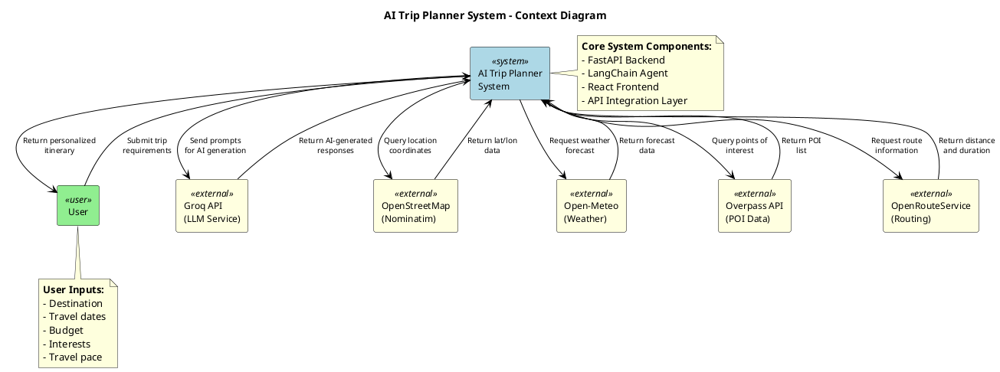
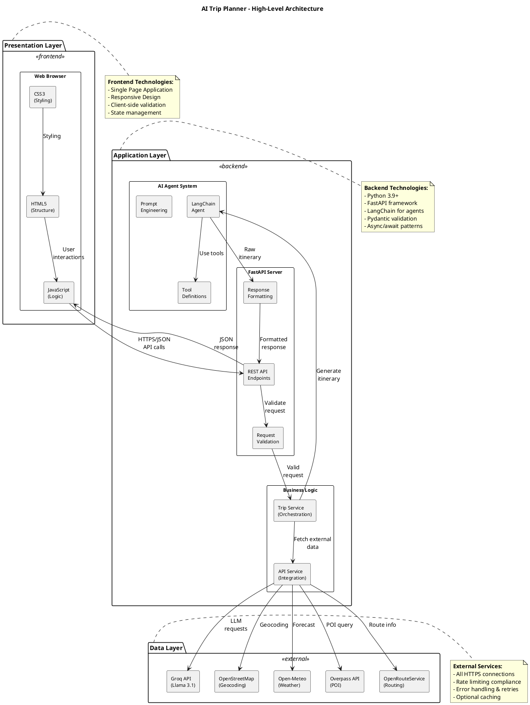
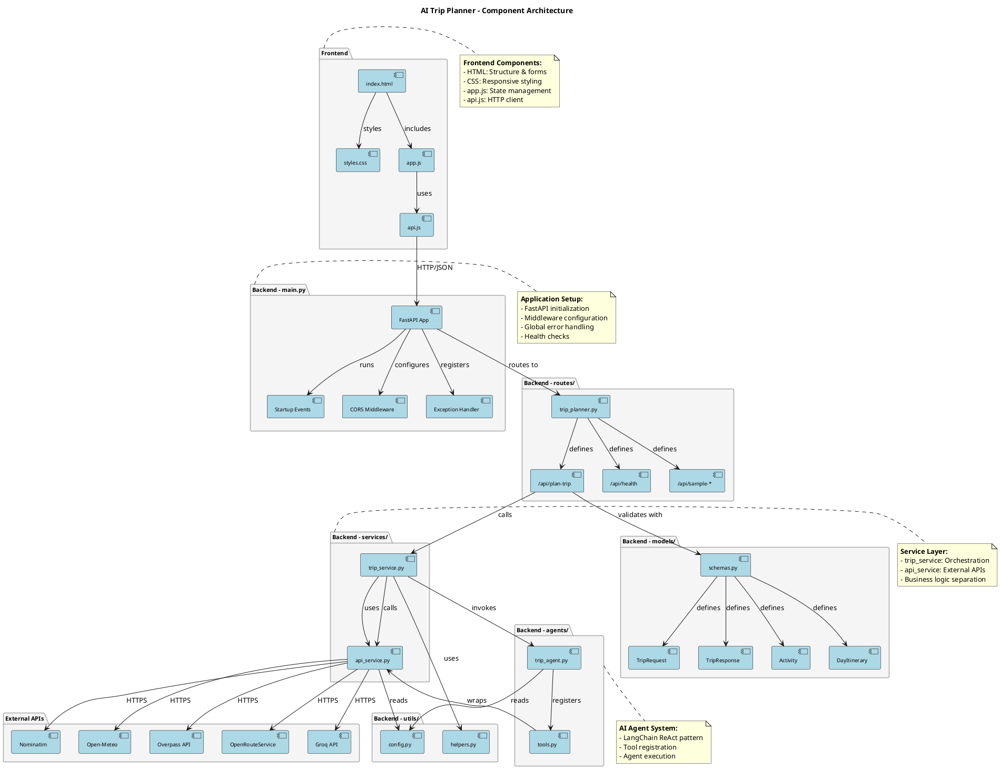

# Design Document - Diagram Appendix

This appendix contains all PlantUML diagram codes referenced in the Design Document. Each diagram can be copied and rendered using PlantUML tools.

**How to Render PlantUML Diagrams:**
1. **Online:** Visit http://www.plantuml.com/plantuml/uml/ and paste the code
2. **VS Code:** Install PlantUML extension and preview `.puml` files
3. **Command Line:** `plantuml diagram.puml` (requires Java and PlantUML jar)
4. **Website Integration:** Use PlantUML server or local renderer

---

## Table of Contents

1. [System Context Diagram](#1-system-context-diagram)
2. [High-Level Architecture Diagram](#2-high-level-architecture-diagram)
3. [Component Architecture Diagram](#3-component-architecture-diagram)
4. [Data Flow Diagram](#4-data-flow-diagram)
5. [Deployment Architecture Diagram](#5-deployment-architecture-diagram)
6. [Data Models Diagram](#6-data-models-diagram)
7. [Sequence Diagram](#7-sequence-diagram)
8. [Security Architecture Diagram](#8-security-architecture-diagram)
9. [UI Wireframe](#9-ui-wireframe)
10. [Entity-Relationship Diagram (Future)](#10-entity-relationship-diagram-future)

---

## 1. System Context Diagram

**File:** `diagrams/system-context-diagram.puml`

**Description:** Shows the AI Trip Planner system and its external actors and systems including users and external APIs.



---

## 2. High-Level Architecture Diagram

**File:** `diagrams/high-level-architecture-diagram.puml`

**Description:** Illustrates the three-tier architecture: Presentation Layer (Frontend), Application Layer (Backend), and Data Layer (External Services).



---

## 3. Component Architecture Diagram

**File:** `diagrams/component-architecture-diagram.puml`

**Description:** Detailed view of all system components including frontend files, backend modules, services, agents, models, utilities, and external API connections.



---

## 4. Data Flow Diagram

**File:** `diagrams/data-flow-diagram.puml`

**Description:** Shows how data flows through the system from user input to final response, including all processing steps, API calls, and decision points.

**Note:** This is a large diagram showing the complete request/response flow. See the file `diagrams/data-flow-diagram.puml` for the complete code.

---

## 5. Deployment Architecture Diagram

**File:** `diagrams/deployment-architecture-diagram.puml`

**Description:** Illustrates deployment topology including client machines, cloud platform infrastructure, load balancers, application servers, containers, environment variables, monitoring, and external service connections.

**Note:** This diagram shows the production deployment architecture with Docker containers, load balancing, and cloud services. See the file `diagrams/deployment-architecture-diagram.puml` for the complete code.

---

## 6. Data Models Diagram

**File:** `data-models-diagram.puml` (already exists in project root)

**Description:** Shows Pydantic data models including TripRequest, TripResponse, Activity, DayItinerary, TripOverview, SmartAdditions, and their relationships.

**Location:** This diagram already exists in your project root directory.

---

## 7. Sequence Diagram

**File:** `sequence-diagram.puml` (already exists in project root)

**Description:** Detailed sequence diagram showing the interaction flow between User, Browser, FastAPI, Services, Agent, Tools, and External APIs during trip planning.

**Location:** This diagram already exists in your project root directory.

---

## 8. Security Architecture Diagram

**File:** `diagrams/security-architecture-diagram.puml`

**Description:** Comprehensive view of security layers including client security, network security, application security, data security, infrastructure security, and monitoring & response mechanisms.

**Note:** This diagram illustrates all security measures implemented in the system. See the file `diagrams/security-architecture-diagram.puml` for the complete code.

---

## 9. UI Wireframe

**File:** `diagrams/ui-wireframe.puml`

**Description:** User interface wireframe showing layout of all UI sections including header, input form, loading state, results display, error handling, and footer.

**Note:** This wireframe shows the visual structure of the web interface. See the file `diagrams/ui-wireframe.puml` for the complete code.

---

## 10. Entity-Relationship Diagram (Future)

**File:** `diagrams/er-diagram-future.puml`

**Description:** Database schema design for future enhancement when persistent storage is added. Includes tables for users, trips, itineraries, activities, favorites, feedback, and caching.

**Status:** Future enhancement - not implemented in version 1.0

**Note:** This ER diagram shows the proposed database schema for future versions with user accounts and trip history. See the file `diagrams/er-diagram-future.puml` for the complete code.

---

## Rendering Instructions

### Online Rendering

1. Copy the PlantUML code for any diagram
2. Visit http://www.plantuml.com/plantuml/uml/
3. Paste the code in the text area
4. View the rendered diagram
5. Download as PNG, SVG, or PDF

### VS Code Extension

1. Install "PlantUML" extension by jebbs
2. Open any `.puml` file
3. Press `Alt+D` to preview
4. Right-click diagram to export

### Command Line

```bash
# Install PlantUML (requires Java)
# Download plantuml.jar from https://plantuml.com/download

# Render single diagram
java -jar plantuml.jar diagram.puml

# Render all diagrams in directory
java -jar plantuml.jar diagrams/*.puml

# Specify output format
java -jar plantuml.jar -tsvg diagram.puml
java -jar plantuml.jar -tpng diagram.puml
```

### Docker

```bash
# Use PlantUML Docker image
docker run -d -p 8080:8080 plantuml/plantuml-server:jetty

# Upload .puml files to http://localhost:8080
```

---

## Diagram File Organization

```
trip-agent/
├── DESIGN-DOCUMENT.md
├── DIAGRAMS-APPENDIX.md (this file)
├── diagrams/
│   ├── system-context-diagram.puml
│   ├── high-level-architecture-diagram.puml
│   ├── component-architecture-diagram.puml
│   ├── data-flow-diagram.puml
│   ├── deployment-architecture-diagram.puml
│   ├── security-architecture-diagram.puml
│   ├── ui-wireframe.puml
│   └── er-diagram-future.puml
├── architecture-diagram.puml (existing)
├── sequence-diagram.puml (existing)
├── data-models-diagram.puml (existing)
└── project-structure-diagram.puml (existing)
```

---

## Image Placeholders in Design Document

The Design Document includes placeholders for rendered diagram images. To insert the actual images:

1. Render each PlantUML diagram to PNG format
2. Save with the corresponding filename:
   - `system-context-diagram.png`
   - `high-level-architecture-diagram.png`
   - `component-architecture-diagram.png`
   - `data-flow-diagram.png`
   - `deployment-architecture-diagram.png`
   - `data-models-diagram.png`
   - `sequence-diagram.png`
   - `security-architecture-diagram.png`
   - `ui-mockup.png` (from ui-wireframe.puml)
   - `er-diagram-future.png`
3. Place images in the same directory as the Design Document or a subdirectory
4. The markdown image references will automatically display the images

---

## Notes

- All diagrams use PlantUML syntax version compatible with PlantUML 1.2021+
- Diagrams are optimized for readability in both online and offline renderers
- Color schemes follow standard PlantUML themes for consistency
- Notes and annotations provide additional context
- All diagrams are version-controlled in the repository

---

**Document Version:** 1.0
**Last Updated:** 2026-02-25
**Compatible with:** Design Document v1.0
